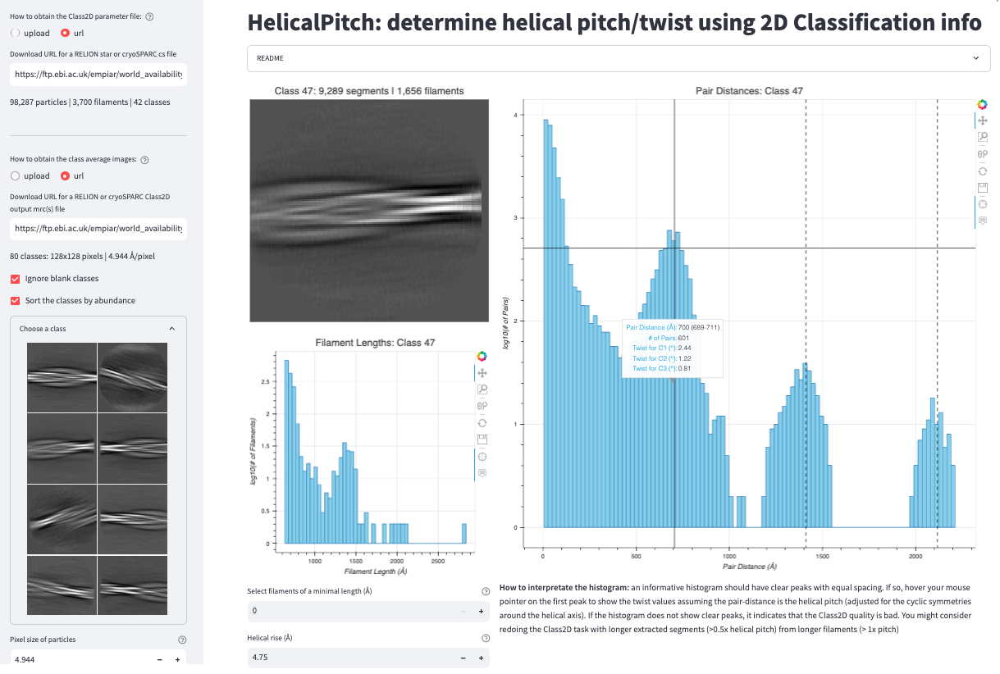

# HelicalPitch: determine helical pitch/twist using 2D Classification info

**HelicalPitch** is a Web App that helps users determine helical pitch/twist using 2D classification info.

No software installation is needed. Just [click me](https://helicalpitch.streamlit.app) to determine the pitch/twist of your helical structure!</a>

